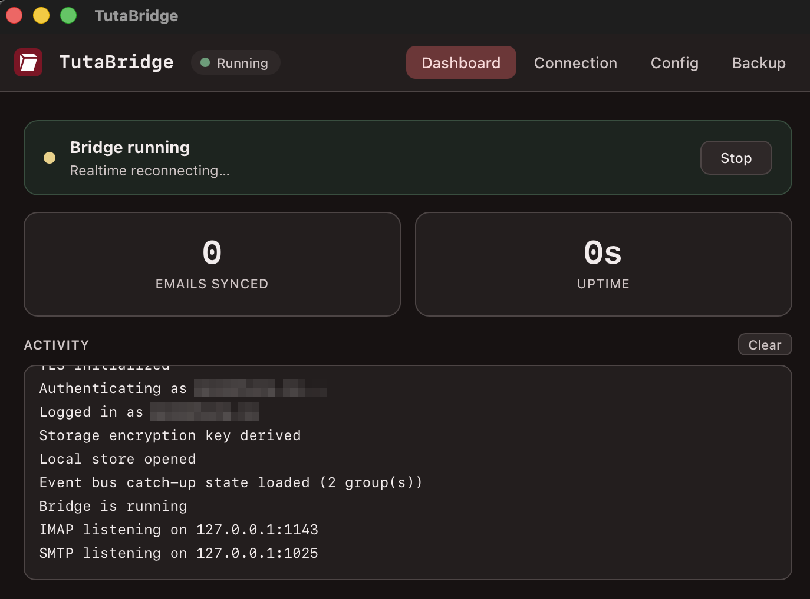
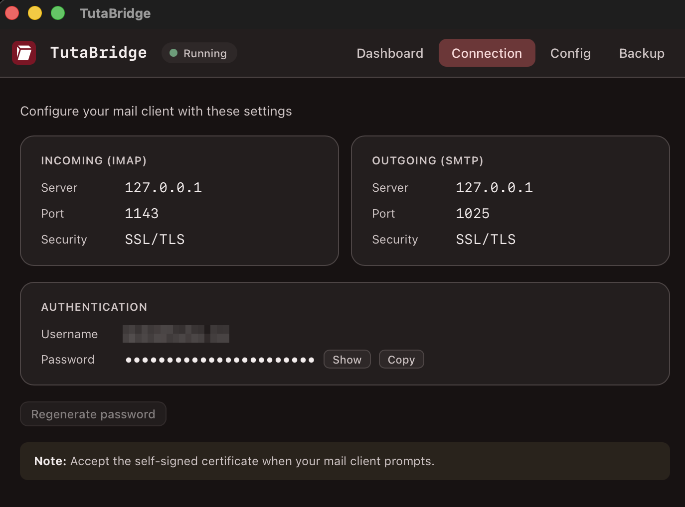

<div align="center">


# TutaBridge

**Use [Tuta](https://tuta.com) encrypted email in Thunderbird, Apple Mail, or any standard mail client.**

A local IMAP/SMTP bridge that talks to Tuta's API and handles the end-to-end
encryption transparently, so your favourite desktop client just works.

<br/>

[](https://github.com/spartanz51/tutabridge/actions/workflows/ci.yml)
[](https://github.com/spartanz51/tutabridge/releases)
[](LICENSE)
[](#download)
[](#build-from-source)

[**Download**](#download) · [**Getting started**](#getting-started) · [**Features**](#features) · [**Backup**](#backup) · [**Architecture**](#architecture)

<br/>




</div>

> ## ⚠️ Please read before using
>
> **TutaBridge goes against Tuta's end-to-end philosophy, and Tuta does not
> endorse it.** Tuta has no official bridge on purpose. Decrypting your mail
> outside their apps and handing it to a local mail client widens your attack
> surface: a compromised device, a shady client add-on, or a buggy MCP client
> now sees your messages in plaintext. Tuta has explained this stance publicly
> ([1](https://www.reddit.com/r/tutanota/comments/tewuzq/comment/i0uu74i/),
> [2](https://www.reddit.com/r/tutanota/comments/cga5dv/can_we_please_get_an_imap_bridge/)).
>
> **So who is it for?** Advanced users who trust their own device but not
> necessarily the email provider, and who want to keep full control of their
> data: read it in any client, back it up to plain files, search it locally,
> automate it. The threat model is "I trust my machine, I just don't want to be
> locked into one vendor's apps." If that isn't you, stay on Tuta's official
> apps. The released binaries are also **not code-signed**, so your OS will warn
> on first launch (see [Download](#download)).

---

## Features

|  |  |
|---|---|
| 📥 **IMAP + SMTP** | Local TLS servers on `127.0.0.1`, so any standard mail client connects. |
| ⚡ **Realtime sync** | Tuta's WebSocket event bus pushes new mail, reads, moves and deletes; a heartbeat reconnects dead sockets automatically. |
| 🗂️ **Whole mailbox** | Every folder and message is listed, not just a recent slice. |
| 🔍 **Honest search** | Subject, sender and date search the entire mailbox; full-text body search via an encrypted on-disk index. |
| 📎 **Attachments** | Both ways. Incoming served as `multipart/mixed`, outgoing uploaded to Tuta on send. |
| 📝 **Folders & flags** | Drafts, custom and nested folders, move, trash, read/unread. |
| 🔐 **Encrypted cache** | Metadata in SQLCipher, bodies as individually encrypted files. Usable instantly on relaunch, only the delta is fetched. |
| 💾 **Complete backup** | Export every message to portable `.eml` files. |
| 🔑 **2FA (TOTP)** | Two-factor login supported. |

---

## Download

Download the app for your OS (see [all releases](https://github.com/spartanz51/tutabridge/releases) for the CLI binaries and checksums):

| OS | Desktop app |
|----|-------------|
| 🍎 **macOS** (Apple Silicon) | [Download `.dmg`](https://github.com/spartanz51/tutabridge/releases/latest/download/TutaBridge-macOS.dmg) |
| 🪟 **Windows** (x64) | [Download installer `.exe`](https://github.com/spartanz51/tutabridge/releases/latest/download/TutaBridge-Windows-setup.exe) |
| 🐧 **Linux** (x64) | [`.AppImage`](https://github.com/spartanz51/tutabridge/releases/latest/download/TutaBridge-Linux.AppImage) · [`.deb`](https://github.com/spartanz51/tutabridge/releases/latest/download/TutaBridge-Linux.deb) · [`.rpm`](https://github.com/spartanz51/tutabridge/releases/latest/download/TutaBridge-Linux.rpm) |

The build is not code-signed, so the first launch needs one click to allow it:

* **macOS**: right-click the app, then **Open**, then **Open**.
* **Windows**: **More info**, then **Run anyway**.
* **Linux**: `chmod +x` the AppImage, or install the `.deb` / `.rpm`.

> Prefer the command line? Every release also ships a single **CLI binary** per
> OS (run it from a terminal; it has no extension, so double-clicking won't work).

**Arch Linux:** the headless CLI daemon is on the AUR as
[`tutabridge-bin`](https://aur.archlinux.org/packages/tutabridge-bin) (prebuilt)
or [`tutabridge-git`](https://aur.archlinux.org/packages/tutabridge-git) (built
from source), e.g. `yay -S tutabridge-bin`.

---

## Getting started

1. **Open TutaBridge** and sign in with your Tuta address. Password and 2FA are
   asked on the first run only; the session is saved to your OS keychain
   afterwards.
2. Note the **bridge password** it shows. It is generated locally for your mail
   client and is **not** your Tuta password.
3. **Add an account** in your mail client with the settings below, then accept
   the self-signed certificate when prompted.

| | Server | Port | Security |
|---|--------|------|----------|
| **IMAP** (incoming) | `127.0.0.1` | `1143` | SSL/TLS |
| **SMTP** (outgoing) | `127.0.0.1` | `1025` | SSL/TLS |

**Username:** your Tuta address. **Password:** the bridge password from step 2.

Keep TutaBridge running while you use your mail client. It is the local server
the client talks to.

> Search runs in your mail client. Subject, sender and date cover the whole
> mailbox; full-text body search covers messages whose body has been downloaded
> (enable "keep every message body offline" for full coverage).

---

## Architecture

Syncer-driven, store-backed. The IMAP server never makes a network call to read:

```
Tuta API  <-  Syncer (background)  ->  MailStore (in-memory)  <-  IMAP server  <-  mail client
                                                              <-  GUI (stats)
```

* The **syncer** pulls from the Tuta API and populates an in-memory `MailStore`,
  backed by the on-disk encrypted cache.
* The **IMAP server** only ever reads from the store. It never makes an API call
  for reads.
* The only IMAP-to-network calls are mutations: mark read/unread (`STORE \Seen`)
  and trash (`EXPUNGE`). Sending goes through SMTP to Tuta's `DraftService` and
  `SendDraftService`.

The storage key is derived from your Tuta session, so there is no extra password
to manage, and the cache is encrypted at rest.

---

## Backup

Export every email to a folder of plain `.eml` files, one per message, in a tree
mirroring your IMAP folders. It enumerates all mail from the server, not just
what is currently synced, so nothing is silently left out.

```
<output>/
├── INBOX/
│   ├── 20260528-144935_OtjDuDU--3-9.eml
│   └── ...
├── Sent/
├── Trash/
└── Café/Projets/...
```

```bash
tutabridge backup ~/TutaBackup        # CLI
```

In the **GUI**, use the **Backup** tab: pick a folder and watch per-folder
progress. The bridge must be running, since the backup reuses its signed-in
session.

* **Format**: `.eml` (RFC 2822). Opens natively in Thunderbird, Apple Mail and
  Outlook, survives Windows filesystems, and one corrupt file never sinks the
  archive. Filenames are date-prefixed so a listing sorts chronologically.
* **Resumable**: re-running into the same folder skips messages already on disk,
  so an interrupted backup resumes and a periodic re-backup only fetches new mail.
* **Scope**: every folder, including Trash and Spam.

---

## Build from source

Requires the Rust toolchain and the `tuta-repo` submodule
(`git clone --recursive`, or `git submodule update --init --recursive`):

```bash
cargo build                      # CLI + core
cargo build -p tutabridge-core   # core library only
cargo run                        # run the CLI from source
./dev.sh                         # GUI in dev mode (cargo tauri dev)
```

---

## Files & locations

Config and cache live under your platform's app-data directory. On macOS that is
`~/Library/Application Support/tutabridge/`:

```
config.toml          account + ports + bridge_password + sync_limit
store.db             SQLCipher metadata + full-text body index
mails/<id>.eml.enc   per-mail encrypted bodies
```

`sync_limit` controls how many recent message bodies are kept offline. The full
mailbox is always listed and metadata-searchable regardless. Set it to `0` (or
tick "keep every message body offline" in the GUI) to download everything.

---

## Testing

```bash
cargo test --workspace        # unit + integration tests
python3 scripts/test_imap.py  # integration test against a running bridge
```

The IMAP integration test connects to the local server and verifies TLS, auth,
folder list, mail count, body fetch and search. It reads the bridge password
from `config.toml` automatically.

---

## SDK

TutaBridge depends on a few additions to Tuta's Rust SDK, vendored as the
`tuta-repo` submodule. Each change is kept as its own single-commit branch off
upstream for easy review and upstreaming. See [`SDK_PRS.md`](SDK_PRS.md) for the
status of each.

---

## License

[GPL-3.0-or-later](LICENSE). TutaBridge links Tuta's Rust SDK (part of the
GPLv3-licensed [tutanota](https://github.com/tutao/tutanota) project), so it is
distributed under the same license.
